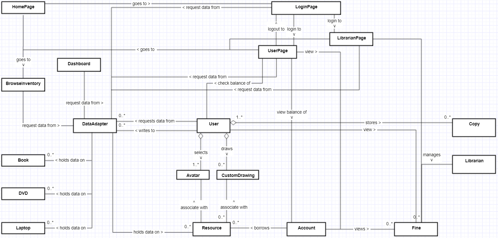
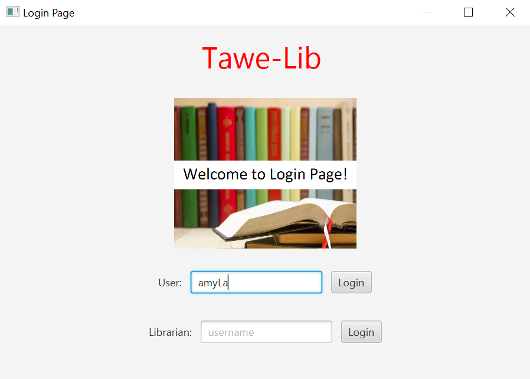
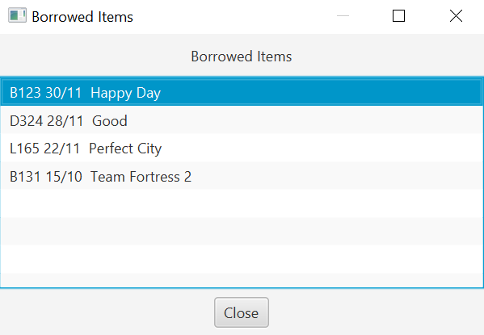
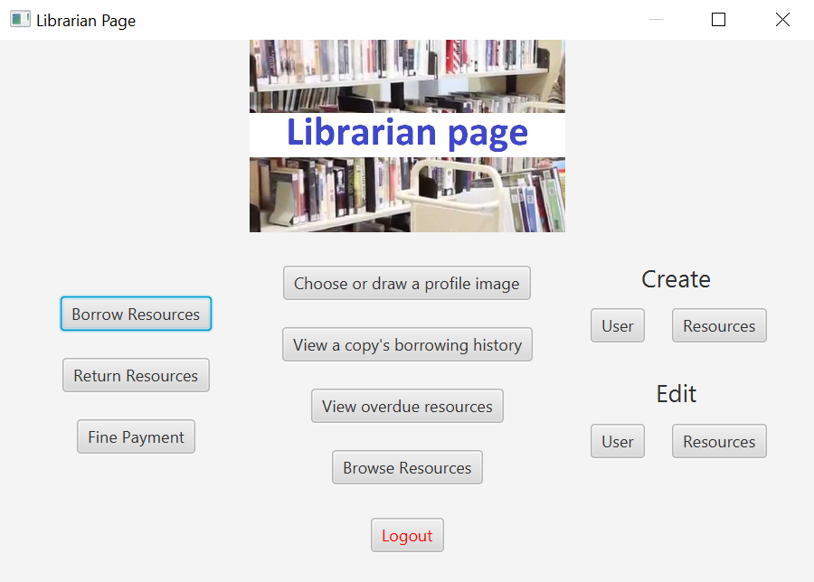
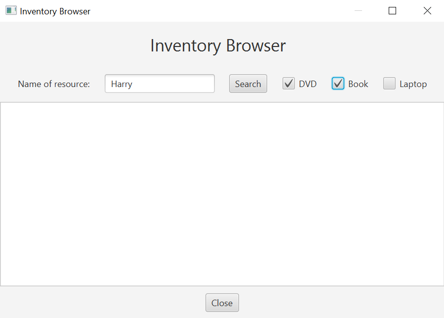

# Library System
This is a Java group project.

Technology/library used: Javafx, FXML 

This library system is an offline system. It allows user to borrow, return resources. Resources include Books, DVDs, Laptops.
This system also helps user to find whether a resource is available to borrow or not. It not, they can queue to become the next one to borrow the resource.

## Design Phrase
Class Collaboration Diagram:

## Implementation Phrase
Login Page for users and librarian:

Users can view their borrowed Items in this page:

Librarian Page:

Inventory Browser provides filter for user to search the resources available in the library:

